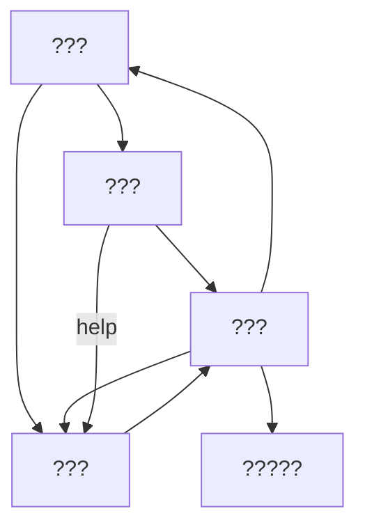

# very bad c compiler (VBCC)

my workings through nora sandler's wonderful book,
[Writing A C Compiler](https://nostarch.com/writing-c-compiler)

## usage

don't use this.

for educational purposes only:

```sh
very-bad-c-compiler <file>

# also accepts some arguments:
very-bad-c-compiler --lex <file> # stops after the lexing phase
very-bad-c-compiler --parse <file> # stops after the parsing phase
very-bad-c-compiler --codegen <file> # stops after the codegen phase
very-bad-c-compiler -S <file> # outputs an assembly file (.s) rather than an executable
```

## requirements

this compiler requires you to have gcc installed on your system. linking is a
special hell that this developer does not wish to dive into, so it merely emits
raw assembly files (.s) that it kindly asks gcc to piece together for it. yes i
see the irony in requiring a c compiler in order to run a c compiler, no i dont
care

it also requires cargo because it's rust, go figure

## structure


